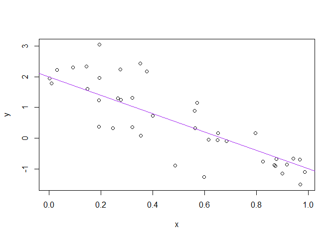

```r
a <- 2
b <- -3
sig_sq <- 0.5
x <- runif(40)
y <- a + b * x + rnorm(40, sd = sqrt(sig_sq))
(x_n <- mean(x))
```

```
## [1] 0.4921581
```

```r
write(x_n, "mittelwert_x.txt")
plot(x, y)
abline(a, b, col = "purple")
```

<!-- -->

```r
dev.print(pdf, "scatterplot.pdf")
```

```
## png 
##   2
```
